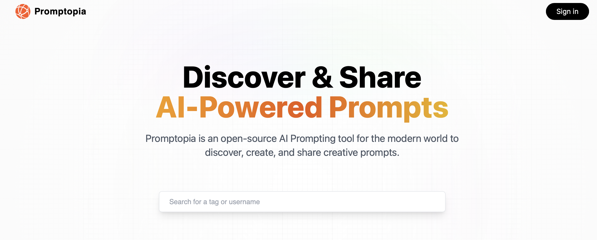

# Promptopia



Promptopia is an open-source AI Prompting tool for modern world to discover, create and share creative prompts. Promptopia uses the [NextJS](https://nextjs.org) React Framework, taking advantage of the use of serveless API endpoint.

## Run Locally

Clone the project

```bash
  git clone https://github.com/hexbacon/promptopia.git
```

Go to the project directory

```bash
  cd promptopia
```

Install dependencies

```bash
  npm install
```

Start NextJS Project

```bash
  npm run dev
```

## Features

#### Implement Search
- **Search by Content:**
  - Search all promopt that include the given string.

- **Search by Tag:**
  - Search for prompts by their associated tags.

- **Search by Username:**
  - Search for prompts created by a specific user.

#### Implement Click on Tag
- Upon clicking a tag, display a list of prompts that share the same tag.

#### Implement View Other Profiles
- Allow users to click on a username or profile picture to navigate to the respective user's profile page.

#### Feed
- Live Feed with recently posted prompts.

#### Responsive Layout
- Fully responsive layout to different screen sizes.


## Schema

### User Schema Description

The User schema represents users in the system. It includes fields such as `email`, `username`, and `image`.

- `email`: Stores the email address of the user. It is unique and required for user identification.
- `username`: Represents the username chosen by the user. It must adhere to a specific regex pattern and be unique.
- `image`: Stores the URL of the user's profile image, allowing users to personalize their profiles.

| Field    | Type   | Constraints                        | Description                                                        |
| -------- | ------ | ---------------------------------- | ------------------------------------------------------------------ |
| email    | String | Unique, Required                   | Email address of the user.                                         |
| username | String | Required, Regex validation, Unique | Username of the user. Must match a specific pattern and be unique. |
| image    | String |                                    | URL of the user's profile image.                                   |

### Prompt Schema Table

The Prompt schema is used to store prompts created by users. It consists of fields such as `creator`, `prompt`, and `tag`.

- `creator`: Stores the ID of the user who created the prompt. It is referenced to the User schema.
- `prompt`: Represents the text of the prompt, which is required for creating a prompt entry.
- `tag`: Stores a tag associated with the prompt, providing additional categorization or context for the prompt.

| Field   | Type                           | Constraints         | Description                                |
| ------- | ------------------------------ | ------------------- | ------------------------------------------ |
| creator | mongoose.Schema.Types.ObjectId | Reference to 'User' | The ID of the user who created the prompt. |
| prompt  | String                         | Required            | The text of the prompt.                    |
| tag     | String                         | Required            | The tag associated with the prompt.        |

## API Reference

#### Post a Prompt

```http
  POST /api/prompt/new
```

| Parameter | Type     | Description                  |
| :-------- | :------- | :--------------------------- |
| `prompt`  | `schema` | **Required**. Prompt and Tag |

#### Get all Prompts

```http
  POST /api/prompt
```

| Parameter | Type     | Description                  |
| :-------- | :------- | :--------------------------- |
| `None`  | `None` | Returns all Prompts in the DB |


#### Get all Prompts For A User

```http
  GET /api/users/[user_id]/posts
```

| Parameter | Type     | Description                  |
| :-------- | :------- | :--------------------------- |
| `User ID`  | `String` | Returns all Prompts for an user |

## Environment Variables

To run this project, you will need to add the following environment variables to your .env file

`GOOGLE_ID`

`GOOGLE_CLIENT_SECRET`

`MONGODB_URI`

`NEXTAUTH_URL=http://localhost:3000`

`NEXTAUTH_URL_INTERNAL=http://localhost:3000`

`NEXTAUTH_SECRET`
